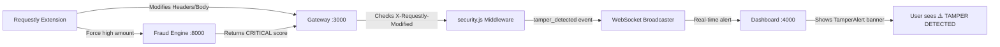

# Requestly API — Role in PayShield

## What is Requestly?

[Requestly](https://requestly.com) is an open-source HTTP interception tool that lets you **modify requests and responses in real time** — headers, bodies, query params, delays, redirects — all without touching source code. It ships as a browser extension, desktop app, and programmable API.

Key capabilities:

| Feature | Description |
|---|---|
| **Modify Request Body** | Rewrite JSON payloads on the fly |
| **Modify Headers** | Inject, remove, or alter HTTP headers |
| **Add Delay** | Simulate latency / timeout conditions |
| **Mock Responses** | Return fake responses without hitting the server |
| **Redirect URL** | Reroute traffic between environments |
| **API Client** | Build, test, and automate API calls |

---

## Why PayShield Uses Requestly

PayShield is a **fraud intelligence engine** — its core job is detecting tampered, suspicious, or malicious payment requests. Requestly plays a **dual role** in the project:

### 1. 🛡️ Tamper Detection (Security Layer)

Requestly simulates a **real-world attack vector** — an attacker using a browser extension to modify API requests before they reach the server.

**How it works:**

```
Client → [Requestly Modifies Request] → Gateway → Tamper Detection Middleware
```

The gateway's `security.js` middleware checks for the `X-Requestly-Modified` header:

```javascript
// gateway/src/middleware/security.js
const tamperDetection = (appEventEmitter) => (req, res, next) => {
    const isModified = req.header('X-Requestly-Modified') === 'true';
    if (isModified) {
        req.tampered = true;
        appEventEmitter.emit('tamper_detected', {
            timestamp: new Date().toISOString(),
            request_id: req.requestId || 'unknown',
            ip: req.ip || req.connection.remoteAddress
        });
    }
    next();
};
```

When detected:
- The request is flagged with `req.tampered = true`
- A `tamper_detected` event is emitted via WebSocket to the dashboard
- The dashboard displays a **red alert banner** in real time
- The transaction is automatically treated as `FRAUD_FLAGGED` regardless of score

### 2. 🧪 Testing & QA (Mocking Layer)

PayShield ships with pre-configured Requestly rules in `requestly/rules.json` for testing edge cases without modifying code:

| Rule | Purpose | Status |
|---|---|---|
| **Force CRITICAL Fraud Score** | Overrides `amount` to ₹15,000 + risky BIN `400010` to trigger CRITICAL label | Active |
| **Simulate BIN Timeout (408)** | Adds 5–8s delay for BIN `456789` to test timeout handling | Inactive |
| **Inject Tamper Marker** | Appends `X-Requestly-Modified: true` header to test tamper detection | Active |

These rules let QA engineers test:
- High-risk transaction flows without creating real high-value payments
- Timeout and retry logic under latency conditions
- The tamper detection pipeline end-to-end

---

## Integration Points



### Files Involved

| File | Role |
|---|---|
| `requestly/rules.json` | Pre-configured interception rules |
| `gateway/src/middleware/security.js` | Detects `X-Requestly-Modified` header |
| `gateway/src/ws/broadcaster.js` | Broadcasts `tamper_detected` events via WebSocket |
| `gateway/src/routes/payment.js` | Flags tampered requests as `FRAUD_FLAGGED` |
| `dashboard/app/components/TamperAlert.tsx` | Renders real-time tamper alert banner |
| `test/integration.sh` | Integration test simulating Requestly tamper |

---

## How to Use

### Step 1: Install Requestly
Download from [requestly.com](https://requestly.com) (Chrome extension or desktop app).

### Step 2: Import Rules
1. Open Requestly → **Rules** → **Import**
2. Select `requestly/rules.json` from the project root
3. Three rules will appear — activate/deactivate as needed

### Step 3: Test Tamper Detection
With the "Inject Tamper Marker" rule active, make any payment request:

```bash
curl -X POST http://localhost:3000/api/v1/payment/initiate \
  -H "Authorization: Bearer <token>" \
  -H "X-Requestly-Modified: true" \
  -H "Content-Type: application/json" \
  -d '{"amount":100,"currency":"INR","card_bin":"411111","device_fingerprint":"d1","merchant_id":"m1","geo":{"country":"IN","ip":"1.1.1.1"}}'
```

**Expected result:** The dashboard shows a red `⚠️ TAMPER DETECTED` banner, and the transaction is blocked as `FRAUD_FLAGGED`.

### Step 4: Test Critical Score
Activate the "Force CRITICAL Fraud Score" rule and send a normal payment — Requestly will silently rewrite the body to trigger a CRITICAL fraud label.

---

## Why This Matters

> In production payment systems, browser extensions like Requestly represent a **real attack surface**. Attackers can modify payment amounts, inject fake headers, or tamper with request bodies.
>
> PayShield's Requestly integration demonstrates **proactive defense** — detecting and blocking these modifications in real time, with full dashboard visibility.

This makes Requestly essential for:
- **Security demos** — Live demonstration of tamper detection
- **QA testing** — Simulating edge cases without code changes
- **Hackathon presentations** — Showing the attack → detect → block → alert pipeline live
